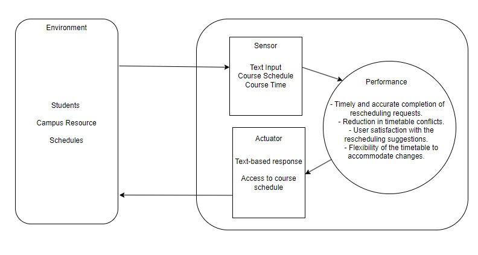

| Property                 | Description                                                                                                                                                                                                                                                                                                                                                                                                     |
| ------------------------ | --------------------------------------------------------------------------------------------------------------------------------------------------------------------------------------------------------------------------------------------------------------------------------------------------------------------------------------------------------------------------------------------------------------- |
| Performance Measure (P): | <ul><li>Objective: Efficiently assist faculty members in rescheduling courses, minimizing conflicts, and optimizing the overall timetable.</li></ul><ul>Metrics:</li><li>Timely and accurate completion of rescheduling requests.</li><li>Reduction in timetable conflicts.</li><li>User satisfaction with the rescheduling suggestions.</li><li>Flexibility of the timetable to accommodate changes.</li></ul> |
| Environment (E)          | <ul><li>Description: The environment is the academic institution's scheduling system, including the existing timetable, faculty schedules, and course details.</li></ul><ul>Features:<li>Current course schedules and timings.</li><li>Faculty availability.</li><li>Constraints and preferences for rescheduling.</li></ul>                                                                                    |
| Actuators (A)            | <ul>Actions Taken by the Chatbot:<li>Proposing alternative time slots for courses.</li><li>Confirming reschedule requests.</li><li>Communicating with the scheduling system to update the timetable.</li></ul>                                                                                                                                                                                                  |
| Sensors (S)              | <ul>Input to the Chatbot:<li>Current faculty course schedules.</li><li>Rescheduling requests from faculty members.</li><li>Constraints and preferences for rescheduling.</li></ul><ul>Output from the Chatbot:<li>Proposed alternative schedules.</li><li>Notifications of confirmed reschedules.</li><li>Notifications of any conflicts or issues.</li></ul>                                                   |

PEAS Model:

