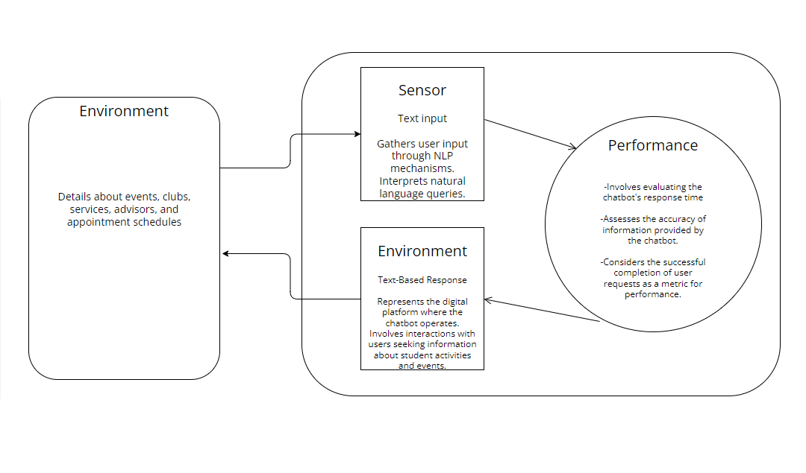

# Assignment 3 Submission 

## Proposed AI Solution 

Proposed AI Solution:
The AI solution for the Student Activities and Events Chatbot is designed to provide personalized assistance and information to students, facilitating their engagement with campus activities and events. The system employs natural language processing (NLP) to understand and respond to user queries, with a knowledge base managing information about events, clubs, services, advisors, and appointments.

## PEAS Model

| Property | Description|
|-----:|-----------|
| Performance Measure  |  The primary goal is to provide accurate and relevant information to users.|
|   |  Performance is measured by the chatbot's ability to understand user queries, offer appropriate recommendations, and facilitate event registrations and club participation.
|   |  Evaluation includes response time, accuracy of information, and successful completion of user requests.
|     Environment|  The environment encompasses the digital platform where the chatbot operates, interacting with users seeking information about student activities and events.    |
|   |  The system interacts with users, event databases, club information, service details, advisor profiles, and appointment schedules.
|     Actuators| The user interface serves as the main actuator, presenting information to users and collecting input through various options.     |
| |  The chatbot triggers responses based on user queries, providing event details, club information, service guidance, and appointment scheduling.
|     Sensors|  The system relies on sensors to gather user input, interpreting natural language queries.     |
| | 	 Sensors include input mechanisms for filtering events, expressing interest in clubs, scheduling appointments, and engaging in live chat with advisors.
| 

## PEAS Model Diagram

